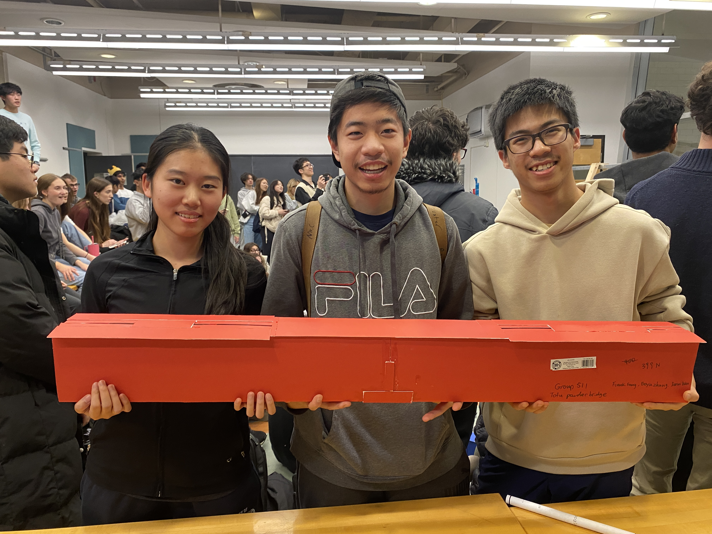

# Final Project, CIV102: Introduction to Structural Engineering

The goal of this project is to build a box-girder bridge out of matboard and contact cement that can support moving trains weighing at least 400N. Before the actual build, our team used Matlab to carry out calculations for the factors of safety against various failure modes, including flexure, shear and buckling. We went through 4 design iterations before arriving at the final design.   

For the final design, our calculated failure load prediction is 1021N, due to shear buckling in the webs. During testing, it failed at 740N due to failure at the supporting edge, which can be attributed to construction inaccuracy.   

Our team placed 4th out of 81 teams in the annual CIV102 bridge contest, where marks are given for strength-to-weight ratio, prediction accuracy, and construction quality.  

> Left to right: [Jiarui Wen](https://github.com/jiarui-wen), [Frank Fang](https://github.com/FaFaFrankie), [Boya Zhang](https://github.com/BoyaZhangNB). <!--Note: We wrote a failure load of 399N on the bridge (the first test is 400N), even though the calculations gave us 1021N, because we didn't have confidence in our construction quality. However, the bridge ended up surviving much longer than we expected! -->

# MATLAB Code

# Moment of Area Calculator

The Moment of Area Calculator can be found in `MoA_Calculator.py`. This program supports click-drag interface to create rectangles to form a cross section. The program calculates the second moment of area, `Im`, in $mm^4$, the location of the centroid in $mm$, the first moment of area, `Q`, in $mm^3$, and the allowable moments and shear at the location of the given cross section. Note that the axis are labeled in milimeters.

`cmd + z` will undo the last rectangle placed.
`cmd + s` will save the current design through printing `input_rect` commands in the terminal; these commonds should be copied directly into `MoA_Calculator.py` to load a saved design.

